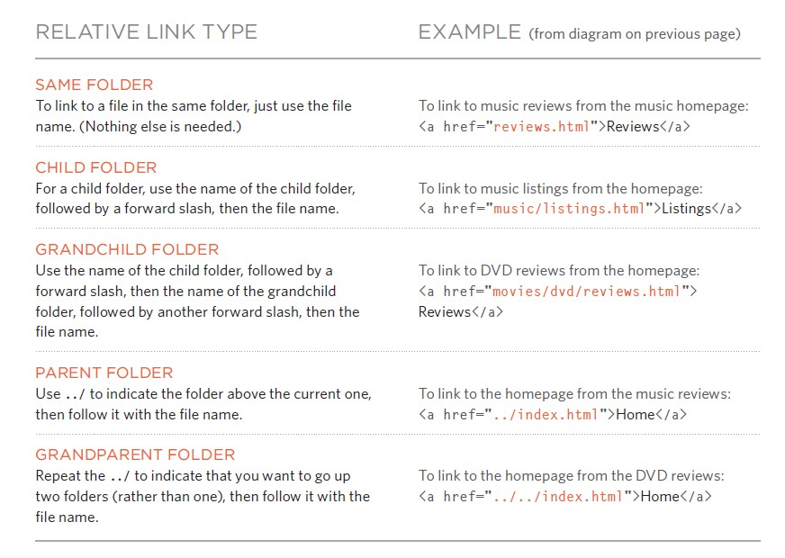

### HTML Links

>Relative URLs can be used when linking to pages within your own
website. They provide a shorthand way of telling the browser where to
find your files.

#### Relative links

>You can use the id attribute to target elements within
a page that can be linked to.

### CSS Positions

### CSS Floating

### JS Function
