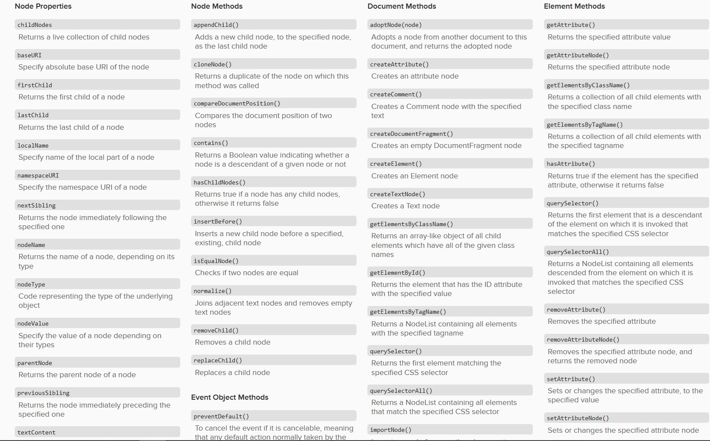

### JS Objects
>A JavaScript object has properties associated with it. A property of an object can be explained as a variable that is attached to the object. Object properties are basically the same as ordinary JavaScript variables, except for the attachment to objects. The properties of an object define the characteristics of the object. You access the properties of an object with a simple dot-notation:

> syntax.
~~~~
var myCar = {
    make: 'Ford',
    model: 'Mustang',
    year: 1969
};
~~~~

>access object's properties and methods.

~~~~
objectName.propertyName;

objectName.methodName();
~~~~

## DOM

>The Document Object Model (DOM) specifies how browsers should create a model of an HTML page and how JavaScript can access and update the contents of a web page while it is in the browser window.

### most common JS DOM  list

